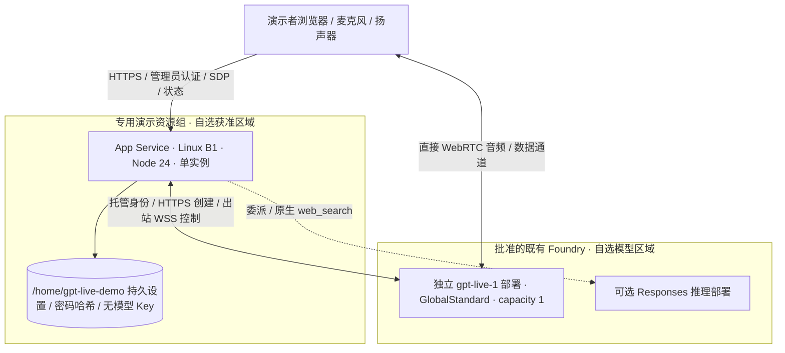

# Azure GPT-Live 演示部署与运营手册

[English](AZURE-DEMO.md) | 简体中文

本手册针对**一位演示者、一个活动语音会话**，不是多租户客户门户。模板、
模拟测试通过与真实 Azure 部署成功是三种不同证据。实际访问地址、部署状态、
视频和私有配置交接记录放在交付者的私有交付目录，不提交到公共仓库。

## 1. 实际协议与能力边界

`gpt-live-1` 是 Azure Foundry 支持的全双工语音模型，不是 `gpt-realtime`
的别名。模型处理听、说、打断和转写；复杂计算、天气、搜索等委派给 Node
服务和兼容 Responses API 的后端。独立日期/时间问题由服务端本机时钟回答。

浏览器提交 SDP；Node 使用服务端凭据调用
`POST /openai/v1/live/sessions`，只返回会话 ID 和 SDP answer。媒体和数据通道
直接连接浏览器与模型。Node 通过
`/openai/v1/live/sessions/{id}/attach` 建立出站 WSS，处理委派和关闭事件。
**GPT-Live 不支持临时客户端密钥**；不要套用 Realtime 的 client_secrets 流程，
更不能把资源 Key 发给浏览器。Azure 模板使用 **App Service 系统托管身份**：
Azure Identity SDK 在服务器获取/缓存短期令牌，只对批准的 Azure AI 地址发送。
`Cognitive Services OpenAI User` 仅授予选定 Foundry 账户范围，不授订阅级角色。
既有账户禁用本地 Key 认证的策略保持不变；Windows/其他兼容部署仍可选择 API Key。

搜索只使用推理后端原生 `web_search`，必须同时看到 completed 搜索调用和来源，
才能宣称联网成功。模型目录可见、聊天成功或模拟测试通过都不构成搜索成功。
天气函数另有 Open-Meteo 公共查询，不是独立搜索供应商。自然打断语音不代表取消
后端业务；此示例没有下单、付款或修改客户数据能力。

## 2. 选定架构与取舍

### Azure Demo Architecture



**Legend：** 实线为实际数据路径，虚线为可选能力；分组表示资源边界，不表示
GlobalStandard 的全部数据处理地点承诺。

**Key Relationships：** 托管区域与模型区域分离；媒体不绕行 App Service。
模型资源所在区域不等于推理数据只在该区域处理，须按 Global 部署条款评估。

| 原有方案 / 候选 | 此次选择与理由 |
| --- | --- |
| 本机 Node、Windows 便携包、Docker | 全部保留。云端使用相同 Node 服务，不另建框架。 |
| VM / AKS | 不选：补丁、证书、节点维护与低并发演示不相称。 |
| ACA | 可行但当前进程内会话和设置文件要求单实例、持久卷；额外存储/配置更复杂。 |
| App Service B1 | 内置 HTTPS、Node 24、持久目录和健康探测；无需 ACR、额外 Storage、数据库。 |
| 扩容 / HA | 未实现：内存登录与语音会话不能跨实例共享。保持 1 实例，不开多进程。 |

区域、模型版本和容量只是模板起点，必须重新验证当前配额、组织策略与可用性。
不要跨订阅寻找生产配额或自动升级为更贵 SKU。主机较近不意味着音频一定更低延迟。

## 3. 前置条件与准备

需要 Node.js 22+（云端 24 LTS）、PowerShell 7、Azure CLI/Bicep、批准的订阅、
可访问的 Foundry、`gpt-live-1` 访问/配额，以及 Chrome/Edge 和 HTTPS。
CLI 身份必须和批准用户一致；每条命令显式指定订阅，不执行 `az account set`。
模型版本、region、capacity 和权限以 ARM validate 和实际调用结果为准。

```powershell
npm ci
npm test
npm run check:release
git diff --check
az bicep build --file .\infra\main.bicep --stdout
az bicep build --file .\infra\identity.bicep --stdout
az bicep build --file .\infra\voice.bicep --stdout
.\scripts\azure-preflight.ps1 -SubscriptionId $subscription `
  -ExpectedUser $approvedUser -AiResourceGroup $aiGroup -AiAccount $aiAccount
.\scripts\azure-package.ps1 -OutputDirectory .\work\package-unique
```

预检仅查询元数据，不调用模型。所有配置向导里的“测试连接”“保存”和“测试搜索”
都可能调用付费服务，不能当作免费预检。包生成采用显式文件白名单，拒绝覆盖
既有输出路径，包含锁定版本的生产 `ws` 和 Azure Identity SDK，不包含 `.env`、
私有设置、日志或录制内容。
上传前检查 ZIP 目录与 SHA-256。不要通过公开 Git 推送部署私有参数。

## 4. 可重复部署

复制 `infra/main.parameters.example.json` 到**仓库外私有目录**，加入安全参数
`setupToken`（随机至少 24 字符）。不要把真实凭据写进命令行、聊天或截图。
为应用选择唯一 `gpt-live-demo-*` 名称，为主机选择新的 `rg-gpt-live-demo-*` 组。
先完成 azure-prepare → azure-validate → azure-deploy，包含身份、配额、
ARM validate、what-if（只有预期新增）、组织 Policy 检查。

```powershell
.\scripts\azure-host.ps1 -SubscriptionId $subscription -ExpectedUser $approvedUser `
  -ResourceGroup $demoGroup -AppName $appName -Location westus2 `
  -ParameterFile $privateParameters -Action Provision -Apply
.\scripts\azure-host.ps1 -SubscriptionId $subscription -ExpectedUser $approvedUser `
  -ResourceGroup $demoGroup -AppName $appName -Action Publish `
  -Archive .\work\package-unique\app.zip -Apply
```

脚本默认不写云；`-Apply` 和 ShouldProcess 确认是防误操作，不代替组织批准。
Provision 创建专用组后重新 validate。已有资源组必须带 `workload=gpt-live-demo`。
首次模型部署使用 `infra/voice.bicep`，只在批准的既有 Foundry 资源组执行，
使用**新的独立 deploymentName**，先 validate/what-if，确认没有现有部署被修改，
再 `az deployment group create --subscription ...`。容量 1 是模板请求值，
不应把目录的默认容量 100 或 quota Count 自动理解为每分钟 token/并发保证。

主机创建系统托管身份后，取 `principalId` 输出，在批准的 Foundry 资源组
validate/what-if 后部署 `infra/identity.bicep`（accountName、principalId）。
此模板只创建该账户级 OpenAI User 角色，不更改账户认证策略。等待角色传播，
再进行真实连接测试；不要因为短暂403去开启本地Key认证或授予Contributor。

主机环境由 Bicep 配置：remote、Node 24、单实例 B1、TLS≥1.2、HTTPS-only、
禁用 FTP/SCM basic auth、启动命令 `node server.mjs`、健康路由 `/api/health`、
远程会话上限 10 分钟。PUBLIC_ORIGIN 可由平台 WEBSITE_HOSTNAME 推导；自定义域名
需显式配置 PUBLIC_ORIGIN。不信任浏览器提交的代理来源来改变允许域名。

## 5. 首次启动与私有数据

1. 打开应用 HTTPS `/api/health`，应为 `{"ok":true}`。这是进程存活，不证明模型可用。
2. 访问 `/setup`，私下输入初始化口令。应用不再把该口令写入日志。
3. 填 Azure 语音资源 API 根地址、**实际部署名称**，鉴权选择“Azure 托管身份”，
   不填 Key；执行语音连接测试。非Azure主机可在获准的兼容服务使用API Key模式。
4. 可选后端使用已获批准的 Responses 部署。非 reasoning 模型选择“默认/none”推理强度。
   不支持搜索时明确关闭开关并讲清能力边界。
5. 设置 Asia/Shanghai、中文或自动语言、10 分钟内时长、简洁指令；创建管理员强密码并保存。
6. 退出再使用管理员密码登录，确认初始化 token 不再作为登录凭据；再测试麦克风和播放。

App Service 模板显式设置 `APP_DATA_DIR=/home/gpt-live-demo`，不依赖进程的 HOME
（应用容器与 SCM 环境可能不同）；默认 App Service 检测也指向这个固定持久挂载路径。
与代码部署目录隔离，升级 ZIP 不覆盖 settings.json。托管身份配置没有模型
Key或访问令牌，只有非秘密连接配置及管理员密码哈希。兼容 API Key 模式仍会在
此文件保存明文Key；平台加密存储不意味着文件本身是密文。严格限制 SCM/控制面权限，
私有备份仍按秘密管理。
不把该设置目录打包进应用 ZIP、视频或 Git。本机开发仍用 `APP_DATA_DIR=./work/dev-data`
和端口 8788，避免碰到安装版数据。

## 6. 服务器保护与已知限制

单进程最多一个活动会话；创建过程中同样拒绝第二个请求。远程模式默认上限 10 分钟，
`MAX_SESSION_MINUTES` 只允许 1–30；客户端请求超过上限返回明确错误，不能靠旧的
localStorage 绕过。到期或显式断开由服务器发送 `session.close`，最多等待 5 秒再
终止旁路连接；记录最终累计秒数。每分钟最多 6 次已认证的创建/保存/探测类 HTTP
操作（保存可能触发两种探测），返回 429 和 Retry-After。关闭、健康、状态不受该限流。
这不是每分钟模型 token 限额，也不是总消费硬上限。

登录已有失败次数保护、Secure/HttpOnly/SameSite cookie；来源与 Host 校验保留。
只有演示主持人持有管理员密码，不能把它作为多人分级授权。启动日志不打印初始化
口令，关闭原因只记录允许枚举，不记录对话全文或未知服务文本；诊断不导出 key/endpoint。
停止页面播放≠关闭计费会话，断开≠删除资源；浏览器/服务器崩溃和网络分区仍应在
服务侧核对会话结束和用量。不要宣传绝对防超支或生产级多租户隔离。

## 7. 演示前 5 分钟

| 时间 | 主持人检查 |
| --- | --- |
| -5:00 | HTTPS、健康接口、管理员登录；不在屏幕共享中打开设置/开发者工具。 |
| -4:00 | 选麦克风、输入电平、播放测试音；耳机避免反馈，关系统通知。 |
| -3:00 | 检查实际语言、时区、音色、10 分钟上限、后端/搜索开关；旧偏好可能保留。 |
| -2:00 | 仅在授权预算内短连，确认听到真实回答和转写；若搜索演示，先看真实来源证据。 |
| -1:00 | 断开预检会话、清理前次转写；声明 AI、合成提问（如使用）、无真实客户数据。 |

## 8. 5–8 分钟讲解流程

| 时间 | 动作与讲解 | 验收 |
| --- | --- | --- |
| 0:00–0:40 | 声明“这是 AI 实时语音演示；录制提问可以是标记的离线合成音频，回答来自真实部署”。 | 应用界面可见，无设置页。 |
| 0:40–1:20 | 连接：“你好，用两句话介绍你能帮客户做什么。” | 真音频+时间戳转写。 |
| 1:20–2:10 | 请模型介绍全双工，在发声中说“请停一下，改用一句话回答”。 | 观察自然打断，不宣称零延迟。 |
| 2:10–3:10 | 问上海日期/时间，再问 `(18×25)+125`。 | 前者本机时钟，后者工具记录与答案575；可见回传状态。 |
| 3:10–4:10 | 可选原生联网查询近期 Azure 官方公告。 | completed+来源；失败就明确降级，不编造联网。 |
| 4:10–5:00 | 切换界面语言，再演示英文短答、静音/恢复。 | UI切换不重连、不丢转写；对话语言与UI独立。 |
| 5:00–6:00 | 总结分工、隐私/费用，点击断开。 | 活动会话0，累计用量记录。 |
| 6:00–7:30 | 可在已断开状态说明架构与FAQ。 | 后期讲解不继续占用付费会话。 |

搜索、天气、复杂回答不可用时不硬凑流程：保留问候、打断、时间、双语，把失败界面
作为可观察边界。录制细节见 [录制指南](RECORDING.md)。
若转写误识别数字或运算符，先核对转写，再用短句重问（如“请计算十加二十”），
不能把正确执行了错误输入的工具结果当作原问题已正确回答。

## 9. 故障与降级

| 现象 | 定位与操作 |
| --- | --- |
| 无麦克风/无声音 | HTTPS、浏览器站点权限、选定设备、电平、系统输出、自动播放策略；真实连接前用本地测试。 |
| 企业网络 WebRTC 失败 | 换批准网络验证 UDP/WebRTC 策略；HTTPS健康通过不代表媒体可达，不承诺WSS自动替代音频。 |
| 401/403 | 检查登录、token是否已失效、服务key/部署权限；不在聊天贴key。 |
| 404/不兼容 | 区分模型名与部署名，确认 `/openai/v1/live`；不能把 Realtime 当替换品。 |
| 429 | 查看 Retry-After，停止连点；区分本地6/min与Azure服务配额。 |
| 后端失败/无来源 | 用源工具日志定位；无来源不宣称查询成功。可跳过推理，仅演示语音和独立时间。 |
| B1 quota=0 | 用 ARM validate 检查已批准的同规格区域；不自动升级或换生产订阅。 |
| 更新后登录失效 | 登录在内存中，重启后重新登录正常；设置文件仍应保留，先验持久目录，别清空配置。 |
| 连接断后疑似继续计费 | 看服务端 session.closed 最终秒数与活动会话0；关闭本任务应用连接并核查模型用量。 |

## 10. 费用、预算与停用

每次演示前按实际区域、部署类型、模型和合同重新核对官方价格。主机费用为
计划小时单价乘运行小时；语音为计费会话分钟乘适用分钟单价；推理、工具、税费
和流量另计。每月 20 场、每场 8 分钟只是 160 分钟用量示例，不是报价，排练和
重试还会增加用量。不要混用 Regional/DataZone、Batch、fine-tuning 报价。

语音含静音、等待后端的全部会话时间；usage是累计数，取最终值，不将每分钟快照相加。
GlobalStandard 不是 PTU/reservation。预算告警有延迟，是通知不是硬性费用上限。
演示时长和应用限流降低风险，但持续重复开会话仍会产生费用。

**停止 Web App 仍会收 B1 Plan 费用。** 临时停演先断开、确认活动0，再运行脚本
`-Action Stop -Apply`。恢复使用 `-Action Start -Apply` 并重新登录。
真正停止托管计费需经批准删除**专用**主机组中的应用和计划；
`azure-host.ps1 -Action Delete -Apply` 会要求确认，只能用于本任务独立组。
不要删既有 Foundry 资源组；本任务语音部署位于另一组，应精确删除其独立 deploymentName。
私有备份、模型和其他服务可能继续存在/计费，清理后查看 Cost Management。

## 11. 升级、回滚与备份

演示结束后备份持久设置目录到受访问控制的位置，记录应用提交号、ZIP SHA-256、
资源清单、参数（秘密分离）、模型版本和已保存偏好。备份前后检查只包含预期文件；
不要在普通下载目录公开存放 key。

Windows 操作者可用 `scripts/azure-backup.ps1`，传显式 SubscriptionId、
ExpectedUser、ResourceGroup、AppName 和仓库外 OutputFile。它通过 Entra
认证读取本应用持久设置，输出当前用户DPAPI加密的clixml，不写明文文件、不启用SCM基本认证。
只能在同一Windows用户/机器解密；异机交接需组织批准的秘密管理方式。
恢复时先停活动会话，私下解密核对version，再通过已授权SCM文件API将settings.json
放回相同挂载目录并重启。不要在Shell或聊天打印解密结果。

发布新白名单 ZIP 会重启应用并丢失内存登录/会话；先断开模型连接，再发布。
回滚使用留存的上一版审计ZIP，沿用同一持久设置目录，不重置用户偏好。
B1不依赖staging slot。重新部署前重新validate区域/配额；不要仅因旧模板曾通过
就假定今天仍可部署。基础设施重应用会重置其管理的环境设置，使用原安全
setupToken或已建立的管理员流程；保存的服务配置优先于环境变量，不靠更改默认值
声称现有会话已切换后端。

不要紧接重启等管理操作立即上传ZIP；SCM容器可能仍在重启。遇502先看
`az webapp log deployment list` 和 SCM `/api/deployments/latest`：
若仍在进行中不重复上传，若因SCM restart最终失败，待平台就绪再重试一次。
CLI返回502不等于应用必然失败，也不能仅凭旧应用仍healthy就宣称新包已部署；
最终核对deployment Succeeded和使用全新登录验证设置保留。

## 官方依据

- [GPT-Live 概念、成本及并发](https://learn.microsoft.com/azure/foundry/openai/concepts/gpt-live)
- [GPT-Live WebRTC、无临时密钥](https://learn.microsoft.com/azure/foundry/openai/how-to/gpt-live-webrtc)
- [完整事件协议](https://learn.microsoft.com/azure/foundry/openai/gpt-live-reference)
- [原生搜索](https://learn.microsoft.com/azure/foundry/openai/how-to/web-search)
- [App Service Node.js](https://learn.microsoft.com/azure/app-service/configure-language-nodejs)
- [删除资源与计费 FAQ](https://learn.microsoft.com/azure/app-service/faq-configuration-and-management)
- [Azure Retail Prices API](https://prices.azure.com/api/retail/prices)：
  筛选 B1 时 serviceName=`Azure App Service`、region=`westus2`；
  语音时 serviceName=`Foundry Models`、skuName=`Live 1 Gl`、region=`eastus2`，
  都取Consumption/USD，勿混用Windows B1、Live 1 DZ或Live-Transcribe。

另见[公开演示资料](demo/README.zh-CN.md)及[通用逻辑架构](demo/architecture.md)。
本文由 AI 辅助编写，以代码与获准的实际验证记录为准；客户演示前由演示者复核。
