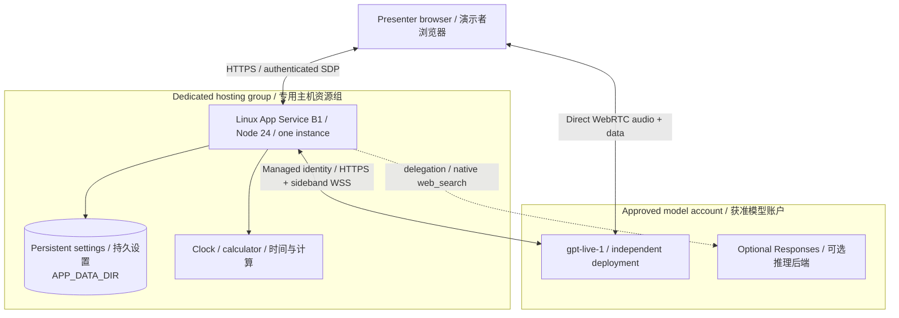

## GPT-Live Demo Architecture

### Legend / 图例

Solid arrows show requests, dependencies or bidirectional links. Dashed arrows
show optional integrations. Groups are resource/administrative boundaries, **not**
private-network boundaries or a data-residency promise.

实线为请求、依赖或双向连接；虚线为可选能力。分组是资源/管理边界，
**不代表**私网隔离或全部推理的数据驻留承诺。

### Key Relationships / 关键关系

The diagram describes `infra/main.bicep`, `identity.bicep`, `voice.bicep` and
the Node runtime, not a measured live deployment. Regions and model availability
must be selected and validated by each deployer.

Browser media goes directly to the live model. The server establishes sessions,
holds model credentials/tokens and manages outbound sideband control.
Managed identity is account-scoped; no model key is sent to the browser.
Local API-key operation remains supported.

App Service settings use `/home/gpt-live-demo`, separate from application ZIPs.
Persistence is not backup or high availability. Login and session state are
process-local: use one process/instance, one session, remote default 10 minutes.
Reasoning and native search are optional; sources and failures remain visible.

图示基于 Bicep 和 Node 源码，不代表实际运行测量；区域、模型可用性须重新验证。
媒体由浏览器直接连接模型，服务端负责建会话、保管凭据和旁路控制。
托管身份仅授予模型账户范围权限，本地 API Key 方式仍兼容。
配置持久目录与代码包分离，但不代表备份/高可用。登录与会话为进程内状态，
保持单实例单进程、单会话；远程默认 10 分钟。推理与原生搜索可选，来源和失败可见。

