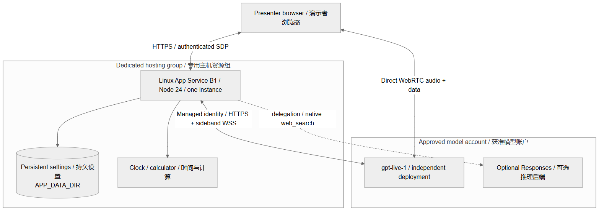

# GPT-Live 演示讲解手册

[English](presenter-guide.md) | 简体中文 · 维护者：**turbo998**

面向售前、架构师、合作伙伴与演示主持人。请自行部署；
`https://voice.example.com` 只是占位示例。访问方式由环境所有者私下提供，
本手册不附带共享服务或凭据。

## 讲清价值与边界

“让语音交流更接近自然对话，同时把推理与工具工作交给受控后端。”
重点展示可观察行为：说话可以交叠、回答中途可以改向、工具结果可以核对，
而不是宣称模型无所不能。这里使用 GPT-Live 会话协议，不把 Realtime、
Voice Live、转写或普通聊天接口混称为同一种产品。

浏览器通过可信 Node 服务协商 SDP，再用 WebRTC 直接连接实时模型音频。
Node 保管凭据、建立旁路连接并委派任务。Azure 可使用模型账户范围的
OpenAI User 托管身份权限；本地/API Key 方式仍保留。
详见[可编辑架构及边界](architecture.md)。

示例使用单实例 Linux B1/Node 24，设置持久目录与部署代码隔离。
区域、模型版本是部署选择，不是当前可用性保证。远程默认会话上限 10 分钟，
单并发，每分钟六次模型相关 HTTP 操作；这不是消费硬上限或多租户授权体系。

## 演示前五分钟

在镜头外检查 HTTPS 和管理员登录，不录制设置页、凭据、开发者工具或私有标签页。
使用耳机，先在本地测试所选麦克风、电平与播放。

检查实际生效的对话/界面语言、时区、搜索和会话偏好，升级会保留旧选择。
只有另获模型调用与费用批准后，才短连问候并核对真实可听回答；
HTTP 健康不等于 WebRTC 已通。关闭预检会话并清理旧转写，使用虚构客户场景。

声明 AI 使用及合成提问/旁白（如有）。切换到审核录像时明确说是之前录制，
不能伪称当前实时调用。不要为演示绕过组织网络或安全控制。

## 六分钟讲解

| 时间 | 动作 | 证据与边界 |
| --- | --- | --- |
| 0:00–0:40 | 介绍虚构咖啡店助手 | 不接真实订单、付款或客户数据 |
| 0:40–1:30 | 请模型用两句话欢迎顾客 | 可听回答与时间戳转写，不编造延迟指标 |
| 1:30–2:20 | 打断长解释，要求一句话 | 观察改向；停止说话不等于取消业务 |
| 2:20–3:30 | 问上海时间，再问 `(18 × 25) + 125` | 本机时钟，再用工具核对 575 |
| 3:30–4:20 | 可选查询近期官方公告 | completed 原生搜索与来源，核对日期与内容 |
| 4:20–4:50 | 切界面语言，再单独请求英文口语 | UI 和对话语言独立，分别验收 |
| 4:50–6:00 | 静音/恢复、总结并断开 | 核对关闭与活动会话零，再讲架构 |

若转写改错数字或运算符，先核对，再用短句重问（如十加二十）。
正确计算误听输入，不代表原问题被正确回答。口头答案不是工具执行证据，
独立“测试联网查询”按钮也不代表语音触发了搜索。

## 客户常问问题

**说“订单取消了”是否证明成功？** 否。须以业务系统权威状态和审计记录为准，
本演示没有订单或付款集成。

**打断是否取消后台工作？** 否。取消、补偿和权限属于应用逻辑，
静音或打断讲话不等于事务回滚。

**浏览器能看到密钥吗？** 模型凭据保留在服务端；托管身份令牌仅用于允许的
Azure 模型地址。API Key 模式在私有服务端文件保存明文，需保护文件权限与备份。

**能直接生产使用或保证驻留区域吗？** 否。单实例状态、主持人登录与 Global
部署不能证明高可用、租户隔离、合规或全部处理在指定区域。

## 费用与故障

每次使用前重查[官方价格](https://prices.azure.com/api/retail/prices)。
主机按计划小时、语音按会话计费时间，推理/工具、流量和税另算。
20 场每场 8 分钟是 160 分钟用量，不含排练与重试。静音和等待仍计时，
累计用量快照不能相加。预算告警有延迟，不是硬上限；停止应用不停止计划收费。

媒体失败检查 HTTPS、权限、设备和 WebRTC 网络策略，先断开再有限重试。
429 遵守 Retry-After。工具/搜索失败必须可见，跳过该能力而不是模拟成功。
不准确回答是模型输出而非事实，需用权威来源核对。

生产化另需身份、工具授权、业务确认、数据保留、地域策略、共享状态、容量、
监控、备份与恢复设计。参阅[运维指南](../AZURE-DEMO.zh-CN.md)和
[媒体限制](media.zh-CN.md)。

改编自 turbo998 自有演示材料，经 AI 辅助编辑。演示者须验证自己的获准环境；
本手册不是实时服务验证证据。
